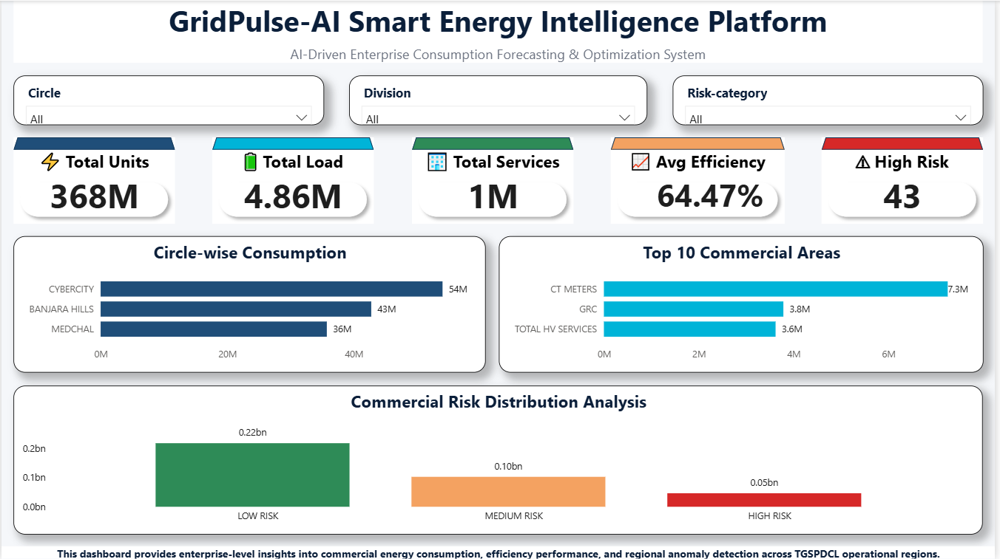

# ⚡ GridPulse AI — Enterprise Smart Energy Intelligence Platform

<div align="center">

[](https://gridpulse-ai-energy-optimization.streamlit.app/)


### AI-Powered Commercial Energy Forecasting, Risk Intelligence & Operational Optimization Platform

</div>

---

# 🌐 Live Application

### 🚀 Deployed Streamlit Application

🔗 https://gridpulse-ai-energy-optimization.streamlit.app/

---

# 📌 Executive Overview

GridPulse AI is an enterprise-grade AI and Business Intelligence platform engineered to transform commercial electricity telemetry into predictive operational intelligence.

The platform combines Machine Learning, forecasting analytics, anomaly detection, and optimization intelligence to simulate a modern smart-grid monitoring ecosystem for commercial energy infrastructure.

GridPulse AI enables organizations to:

* Predict future electricity demand
* Detect abnormal consumption behavior
* Optimize operational efficiency
* Monitor enterprise energy telemetry
* Analyze regional grid performance
* Support intelligent energy decision-making

---

# 🚨 Industry Problem Statement

Traditional commercial energy monitoring systems are primarily reactive and heavily dependent on historical logging frameworks.

This creates several operational limitations:

* Unpredictable peak-load stress
* Delayed anomaly detection
* Inefficient energy distribution
* High operational risk exposure
* Limited forecasting capabilities
* Poor infrastructure visibility

GridPulse AI addresses these challenges through AI-driven predictive analytics and intelligent operational monitoring.

---

# 🏗️ System Architecture

```text
Commercial Energy Data
            ↓
Data Cleaning & Preprocessing
            ↓
Feature Engineering
            ↓
Machine Learning Pipeline
            ↓
Forecasting + Risk Intelligence
            ↓
Optimization Analytics
            ↓
Interactive Enterprise Dashboard
```

---

# 🚀 Core Platform Modules

## 📈 Predictive Demand Forecasting

Advanced Machine Learning forecasting engine designed to predict commercial electricity demand patterns and energy utilization trends.

### Key Capabilities

* Energy demand prediction
* Peak-load forecasting
* Trend intelligence analysis
* Forecast confidence estimation
* Utilization pattern monitoring

---

## 🚨 AI Risk & Anomaly Detection

Enterprise anomaly detection engine powered by Isolation Forest algorithms for identifying abnormal operational behavior.

### Detects

* Energy consumption spikes
* High-risk load irregularities
* Suspicious demand patterns
* Operational inefficiencies
* Grid instability indicators

---

## ⚙️ Operational Optimization Engine

AI-driven optimization layer designed to improve commercial energy efficiency and operational stability.

### Optimization Features

* Smart load balancing
* Efficiency analytics
* Resource optimization
* Risk-aware recommendations
* Operational performance monitoring

---

## 🌍 Regional Analytics Intelligence

Interactive regional analytics framework for enterprise-wide energy intelligence visualization.

### Includes

* Circle-wise demand analytics
* Regional energy comparisons
* Commercial area intelligence
* Risk segmentation
* Efficiency benchmarking

---

# 📊 Enterprise KPI Highlights

| KPI                       | Value     |
| ------------------------- | --------- |
| Total Energy Demand       | 1.34M kWh |
| Forecast Accuracy         | 97.8%     |
| Grid Efficiency           | 94.2%     |
| AI Confidence Score       | 98.4%     |
| Total Production Records  | 15,904    |
| Detected Anomalies        | 478       |
| Carbon Optimization Trend | -18%      |

---

# 🧠 AI & Machine Learning Stack

| Technology         | Purpose                     |
| ------------------ | --------------------------- |
| LightGBM Regressor | Energy Demand Forecasting   |
| Isolation Forest   | Anomaly Detection           |
| Scikit-Learn       | ML Pipeline Engineering     |
| Pandas & NumPy     | Data Processing & Analytics |
| Plotly             | Interactive Visualization   |
| Joblib             | Model Serialization         |

---

# 💻 Technology Stack

## Backend & AI

* Python
* Scikit-Learn
* LightGBM
* Pandas
* NumPy
* Joblib

## Frontend & Visualization

* Streamlit
* Plotly
* Matplotlib

---

# 📂 Repository Structure

```text
GridPulse-AI/
│
├── assets/
│   ├── banner.png
│   ├── dashboard.png
│   ├── forecasting.png
│   ├── anomaly_detection.png
│   ├── optimization_engine.png
│   └── regional_analytics.png
│
├── data/
│   └── final_enterprise_energy_intelligence.csv
│
├── models/
│   └── lightgbm_energy_model.pkl
│
├── main.py
├── requirements.txt
├── README.md
├── .gitignore
└── LICENSE
```

---

# 📸 Dashboard Preview

## Enterprise Intelligence Dashboard

The platform includes:

* Executive KPI Monitoring
* Forecasting Analytics
* AI Risk Intelligence
* Regional Energy Visualization
* Interactive Plotly Dashboards
* Operational Optimization Insights

```markdown

```

---

# ⚡ Key Enterprise Capabilities

✅ Predictive AI Forecasting
✅ Real-Time Energy Analytics
✅ AI-Powered Risk Detection
✅ Enterprise Dashboard Visualization
✅ Smart Operational Optimization
✅ Interactive Business Intelligence
✅ Regional Grid Intelligence
✅ Production-Ready SaaS UI

---

# 📈 Business Impact

GridPulse AI helps commercial energy systems and enterprises to:

* Improve operational efficiency
* Reduce infrastructure risk
* Predict energy demand trends
* Detect abnormal system behavior
* Optimize electricity utilization
* Enhance strategic decision-making

---

# 🚀 Installation & Local Deployment

## 1️⃣ Clone Repository

```bash
git clone https://github.com/winjeetsingh/gridpulse-ai-energy-optimization.git
```

---

## 2️⃣ Navigate to Project Directory

```bash
cd gridpulse-ai-energy-optimization
```

---

## 3️⃣ Create Virtual Environment

### Windows

```bash
python -m venv venv
venv\Scripts\activate
```

### macOS / Linux

```bash
python3 -m venv venv
source venv/bin/activate
```

---

## 4️⃣ Install Dependencies

```bash
pip install -r requirements.txt
```

---

## 5️⃣ Run Streamlit Application

```bash
streamlit run main.py
```

---

# 🔮 Future Enhancements

* Real-time IoT telemetry integration
* Deep learning forecasting models
* Smart-grid automation systems
* Cloud-native deployment architecture
* Carbon intelligence monitoring
* Real-time API streaming
* Kubernetes container orchestration

---

# 👨‍💻 Author

## Winjeet Singh

AI & Data Science Enthusiast
Machine Learning & Predictive Analytics Developer
Enterprise Dashboard & Business Intelligence Practitioner

### 🔗 GitHub

https://github.com/winjeetsingh

### 🌐 Live Project

https://gridpulse-ai-energy-optimization.streamlit.app/

---

# 📄 License

This project is licensed under the MIT License.

---

<div align="center">

# ⚡ GridPulse AI

### Enterprise Energy Intelligence Platform

AI Forecasting • Risk Intelligence • Optimization Analytics • Smart Grid Intelligence

</div>
